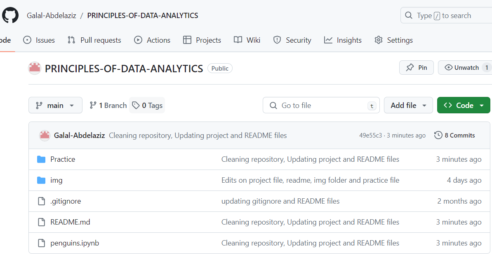
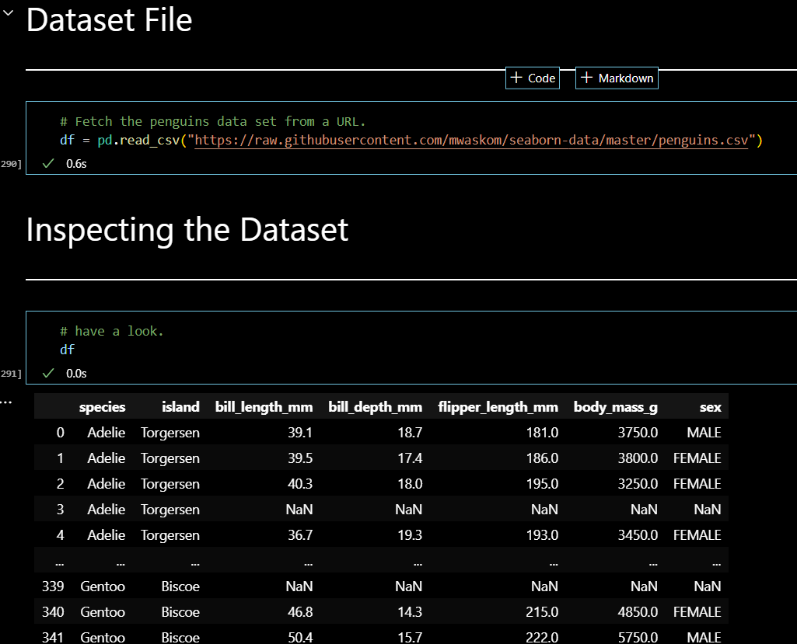

# Principles-of-Data-Analytics
***

Author: Galal Abdelaziz

## [Palmer Penguins Dataset](https://allisonhorst.github.io/palmerpenguins/) analysis, conducted by __Galal Abdelaziz__, is part of the Principles of Data Analytics module in Summer 2023/2024, at [ATU](https://www.atu.ie/).

***

### Technologies:

* Python 3.11.5 available [here](https://www.anaconda.com/download)
* Visual Studio Code available [here](https://code.visualstudio.com/)

***

The given [instructions](https://ianmcloughlin.github.io/2324_principles_of_data_analytics/) divides the assessment into three overlapping components: 

* Set of tasks. 
* Small project.
* Presentational component. 

I made every effort to address all three components.

***

### Tasks:

* Create a GitHub repository with a README.md and a .gitignore. Add a Jupyter notebook called penguins.ipynb and add a title to it.

* Find the palmerpenguins data set online and load it into your Jupyter notebook. In your notebook, give an overview of the data set and the variables it contains.

* Suggest the types of variables that should be used to model the variables in the data set in Python, explaining your rationale.

* Create a bar chart of an appropriate variable in the data set. Then create a histogram of an appropriate variable in the data set.

 

***

### Project:

Select two variables from the data set and provide an analysis of how correlated they are.

***
## End